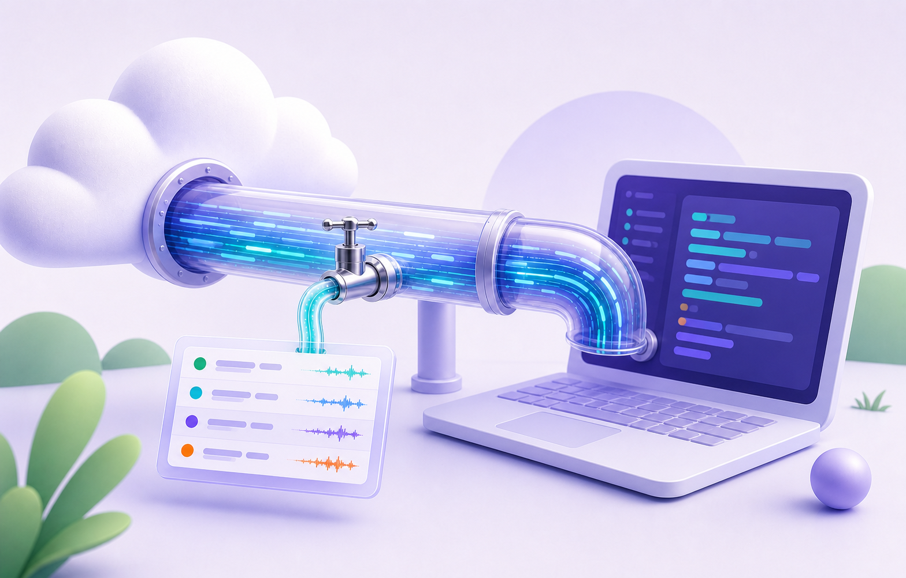
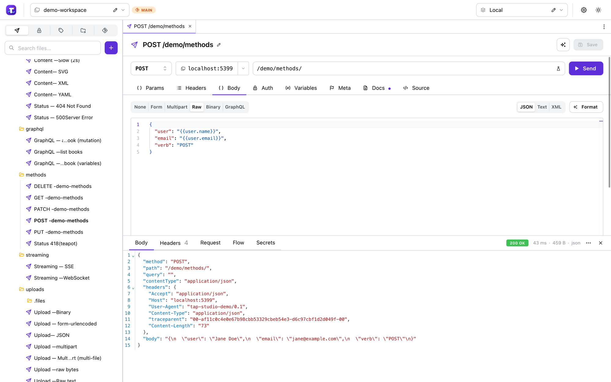
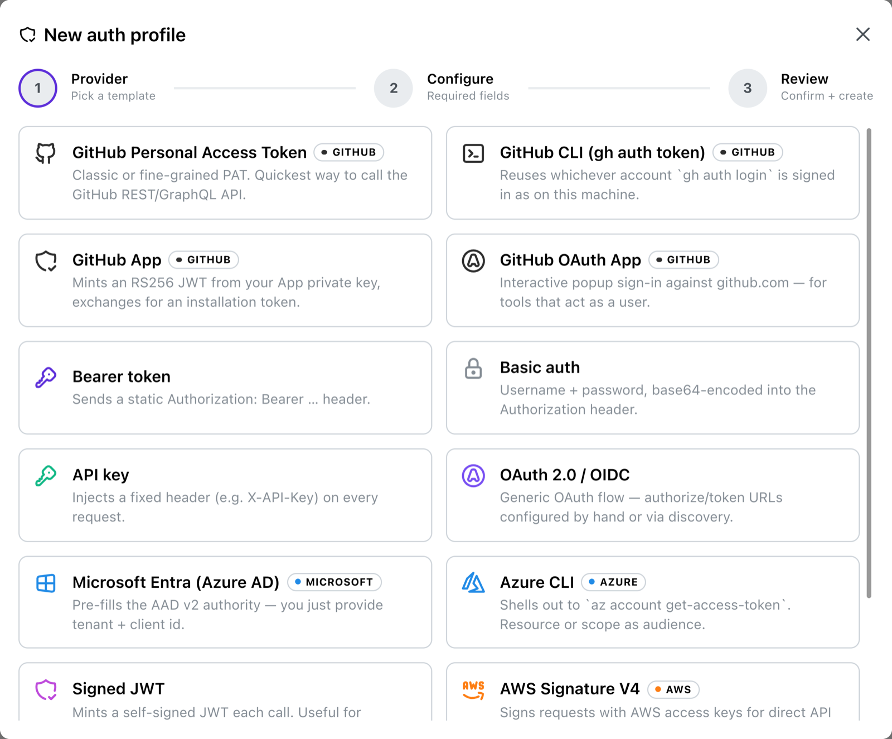
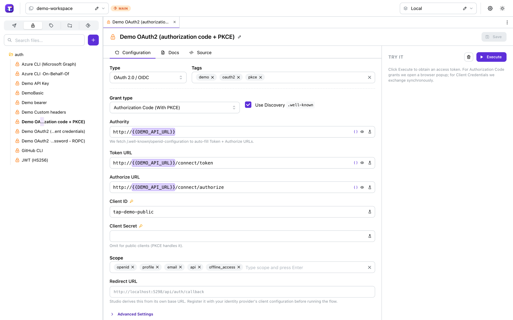
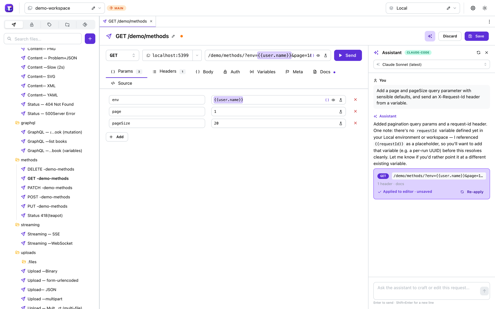
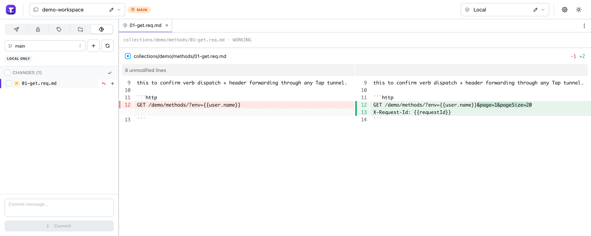

<div align="center">
  <p>
    
  </p>

  <picture>
    <source srcset="assets/tap-hero-dark.png" media="(prefers-color-scheme: dark)">
    
  </picture>

  <p><strong>Two local-first tools for HTTP: one to watch traffic arrive, one to send it.</strong></p>

  <p>
    <a href="https://philbir.github.io/tap/"><strong>Landing page and docs</strong></a>
  </p>

  <p>
    <a href="https://philbir.github.io/tap/"></a>
    
    
    
    
    
  </p>
</div>

---

## The big picture

Local HTTP development has two halves. Sometimes the internet needs to reach your laptop —
a webhook, an OAuth callback, a mobile build, a partner poking at your machine for ten minutes
— and you need to see exactly what arrived. Other times *you* are the client, and you need to
compose a request, authenticate properly, send it, and keep it somewhere your team can find it
next month.

Tap is two products, one for each half:

| | | |
|---|---|---|
| 🔌 | **[Tap Tunnel + Inspector](#-tap-tunnel--inspector)** | Give localhost a real public URL through Cloudflare Tunnel or Tailscale, and capture every request, response, SSE event, and WebSocket frame that flows through it. Runs as the `tap` CLI or as .NET Aspire resources. |
| 🧪 | **[Tap Studio](#-tap-studio)** | An HTTP workbench: compose requests, run real authentication flows, execute, and keep the whole workspace in your git repo as Markdown. Ships as a desktop app, with an AI assistant built in. |

They share a philosophy more than they share code:

- **Local-first.** Everything runs on your machine. No account, no cloud workspace, no
  telemetry. Quick tunnels cost nothing; stable hostnames just need a domain you already own.
- **Plain text, in your repo.** Studio's workspace is Markdown with YAML frontmatter — no
  proprietary export, no sync service, ordinary git diffs.
- **Secrets stay out of files.** The Inspector never persists credentials; Studio resolves
  secret references at execute time and keeps tokens in your OS state folder, never in the
  workspace.
- **Explicit boundaries.** Tunnels are private by default where the provider allows it, and
  public exposure is something you opt into with your eyes open.

```text
inbound    Internet ─▶ Cloudflare Tunnel / Tailscale ─▶ Tap capture proxy ─▶ your service
                                                              │
                                                              ▼
                                                        Inspector UI
                                                        requests · SSE · WS · replay

outbound   request.req.md + auth profile + environment ─▶ Tap Studio ─▶ any API
           └──────── Markdown, in your repo ─────────┘     executor
```

Use either on its own. Used together, Studio composes the call and the Inspector shows you what
your service actually received.

---

## 🔌 Tap Tunnel + Inspector

For the moment when localhost needs to behave like a real internet endpoint, but you still want
full visibility into every request. Mobile app hooks, webhook deliveries, third-party OAuth
redirects, partner integrations, and "can you hit my laptop for a minute?" demos all need the
same two things: a tunnel that is quick to bring up, and a request log that tells you what
actually happened.

📖 **Full reference: [docs/inspector.md](docs/inspector.md)**

> [!WARNING]
> **Public tunnels are scanned within minutes.** As soon as a public hostname's TLS certificate
> hits a CT log — immediately, when Cloudflare Tunnel or Tailscale Funnel comes up —
> opportunistic scanners start probing for admin endpoints and known-CVE banners. Always pair
> public tunnels with Tap's auth options (header / CIDR / country / OIDC) or edge controls like
> Cloudflare Access and WAF rules. For Tailscale, prefer `WithTailscaleServe(...)`
> (tailnet-only) over `WithTailscaleFunnel(...)` (public) unless you actually need internet
> exposure.

### What it does

| | |
|---|---|
| **Tunnels without ceremony** | Free TryCloudflare URLs, dashboard connector tokens, API-managed Cloudflare tunnels + DNS, or Tailscale Serve/Funnel when your tailnet is the right boundary. |
| **Captures every hop** | Method, host, path, headers, status, timing, request and response bodies, and image previews — recorded before forwarding to your upstream. |
| **Live streaming protocols** | `text/event-stream` responses and WebSocket connections proxy through the same port and render as live, direction-tagged timelines in dedicated **SSE** and **WS** tabs. |
| **Replay and QR** | Replay any captured request; scan the public URL straight onto a phone from the **QR** tab. |
| **Aspire-native** | Model inspectors and tunnels in your AppHost. Allocated ports and generated hostnames resolve at startup and show up in the dashboard. |
| **Auth on the public path** | Header, CIDR, country, and OIDC checks gate the proxy branch before traffic reaches your upstream. The UI port stays local. |

### Install

All three routes install the same `tap` CLI.

```bash
dotnet tool install -g Tap                                                   # .NET 10 SDK on PATH
curl -fsSL https://raw.githubusercontent.com/philbir/tap/main/install.sh | sh # Linux/macOS, self-contained
irm https://raw.githubusercontent.com/philbir/tap/main/install.ps1 | iex      # Windows
```

Make sure `~/.dotnet/tools` (Linux/macOS) or `%USERPROFILE%\.dotnet\tools` (Windows) is on your
`PATH`. Pin a version with `TAP_VERSION=0.1.0` (or `$env:TAP_VERSION` on Windows). Archives are
also on the [Releases](https://github.com/philbir/tap/releases) page as
`tap-<version>-<rid>.tar.gz` with a `SHA256SUMS` alongside.

Cloudflare features need [`cloudflared`](https://developers.cloudflare.com/cloudflare-one/connections/connect-networks/downloads/)
on `PATH` — `brew install cloudflared`, `winget install Cloudflare.cloudflared`, or
`tap install-cloudflared`. Tailscale host modes need the
[`tailscale`](https://tailscale.com/download) CLI; Docker mode doesn't.

### Quick start — CLI

```bash
tap run http://localhost:3000
```

Proxy on <http://localhost:4444>, Inspector UI on <http://localhost:4445>.

```bash
# throwaway public URL, no account needed
tap run http://localhost:3000 --quick

# your own hostname, via a tunnel you created in the Cloudflare dashboard
tap run http://localhost:3000 --token "$CLOUDFLARE_TUNNEL_TOKEN" --hostname api-local.example.com

# tailnet-only (the safe default)
tap run http://localhost:3000 --tailscale

# public Tailscale Funnel — pair it with auth
tap run http://localhost:3000 --tailscale --tailscale-public --auth-header "X-Tap-Key=$TAP_KEY"
```

Every flag, every environment variable, and the `tap.config` file format:
[docs/inspector.md](docs/inspector.md#cli-reference).

### Quick start — Aspire

```csharp
using Aspire.Hosting;

var builder = DistributedApplication.CreateBuilder(args);

var api = builder.AddProject<Projects.Sample_Api>("api");

var tap = builder.AddTap<Projects.Tap_Server>();
api.WithTap(tap);

builder.Build().Run();
```

Inspector UI on <http://localhost:5198>; traffic through <http://localhost:5199> is recorded
before it reaches `api`. Add `.WithQuickTunnel()`, `.WithTunnel(...)`, `.WithTailscaleServe(...)`,
or `.WithTailscaleFunnel(...)` to put a tunnel in front — the
[Aspire recipes](docs/inspector.md#aspire-recipes) cover each mode.

### Packages

| Package | Purpose |
|---|---|
| `Tap.Hosting` | Aspire AppHost extensions: `AddTap`, `AddTapContainer`, `WithTap`, `WithTunnel`, `WithQuickTunnel`, `WithTailscaleServe` (tailnet-only, default), `WithTailscaleFunnel` (public, opt-in), `WithExistingTunnel`, `WithApiManagedTunnel`, `WithDynamicHostname`, `WithSystemDaemon` / `WithEphemeralDaemon` / `WithFunnelPort`. |
| `Tap.Server` | ASP.NET Core capture server: YARP reverse proxy, capture middleware, WebSocket-terminating proxy, SSE event parser, REST API, `/api/stream` push channel, and the bundled React Inspector UI. |
| `Tap.Cli` | Local command host that reuses the same server code. |

Both entry points run the same `Tap.Server` host: the CLI builds `TapInspectorOptions` from
flags, environment variables, and `tap.config`; Aspire writes the same options as project
environment variables.

---

## 🧪 Tap Studio

The other direction: **you** are the client. Studio is a full HTTP request workbench —
compose, authenticate, execute, document — with a workspace that lives in your repository as
plain Markdown.

📖 **Full reference: [docs/studio.md](docs/studio.md)** ·
📄 **On-disk format: [docs/workspace-format.md](docs/workspace-format.md)**



### What it does

| | |
|---|---|
| **Full request composition** | Method, URL, query params, headers, and bodies as `None` / `Form` / `Multipart` / `Raw` / `Binary` / `GraphQL` — with JSON/XML formatting, multi-file uploads, and a GraphQL editor backed by the live schema. |
| **Real responses** | Status, duration, size, syntax-highlighted body with image and binary previews, plus **Headers**, the exact **Request** that went on the wire, the auth/variable **Flow**, and which **Secrets** were resolved. |
| **Streaming** | SSE responses stream in live; requests marked `protocol: websocket` open a real socket and append frames as they arrive. |
| **Many authentication flows** | OAuth 2.0 / OIDC (authorization code + PKCE, client credentials, ROPC, device code), Microsoft Entra, Azure CLI (direct + on-behalf-of), GitHub (PAT / `gh` CLI / GitHub App / OAuth App), AWS SigV4, signed JWT, bearer, basic, API key, and custom headers. |
| **AI assistance** | Hand the request to GitHub Copilot CLI or Claude Code — running locally, with your existing CLI login — and get a proposed edit you review before saving. |
| **Git-native workspace** | Requests, collections, auth profiles, and environments are Markdown files. Built-in branch, diff, stage, and commit. |
| **Variables and secrets** | A six-level cascade (workspace → collection → stage → environment → request → per-run) over pluggable providers: process env with allowlists, an encrypted workspace file, Azure Key Vault, and machine-local system variables. |

### Authentication, properly

Creating an auth profile starts from a template catalog; the wizard then asks only for the
fields that flow actually needs, and shows you what it will write before it writes it.



Tokens never touch the workspace — they live in `~/.tap/auth-tokens.json`, keyed by workspace
and profile, and refresh automatically. The redirect URI is owned by the runtime and shown
read-only so you know exactly what to register with your identity provider; the desktop app
uses the stable `tap-studio://callback` deep link instead of an ephemeral loopback port. You
can also pick which browser and profile handles an interactive sign-in, so a work tenant
doesn't land in your personal session.



Details and the full grant matrix: [docs/studio.md](docs/studio.md#authentication).

### AI assistance

Studio spawns an AI coding CLI you already have installed — no bundled SDK, no extra
credentials. The assistant is handed the request you're editing plus the collection's base URL,
default auth, and shared headers, the available auth profiles, the environment names, and the
variable catalog, so it edits *your* workspace instead of inventing endpoints and tokens.



It never writes files. It proposes a structured request that the UI applies to the editor as an
unsaved change, together with Markdown documentation for the request — you review the diff and
decide whether to keep it. Secrets are always referenced as `{{variables}}`, never inlined.

### The workspace is your repo



```
.tap/
├── tap.md                                ← workspace: name, providers, default env
├── auth/corp-entra.auth.md               ← auth profile shared by every collection
├── environments/local.env.md             ← named variable set
└── collections/billing/
    ├── _collection.md                    ← baseUrl, stages, default auth/headers
    ├── billing-oauth.auth.md             ← auth profile scoped to this collection
    └── create-customer.req.md            ← one request, as a fenced http block
```

Because a request is a couple of lines of Markdown, review, blame, cherry-pick, and revert all
work the way they do for code. Studio is the only thing that writes the YAML — editors PUT a
typed spec and the server re-emits the file — so what lands in your diff is predictable.

### Install and run

Studio ships as a native desktop app (Tauri 2 wrapping the self-contained `Tap.Studio`
sidecar). Grab the `.dmg`, `.msi`/`.exe`, or `.deb` from
[Releases](https://github.com/philbir/tap/releases); it self-updates from there.

From source, the whole dev loop is one command:

```bash
cd samples
aspire run
```

That brings up `demo-api` (an upstream exercising every verb, content type, SSE, WebSockets,
GraphQL, and a real OAuth2/OIDC server), `studio-api`, and the Vite UI on port 5297. Point it
at your own repo with `STUDIO_WORKSPACE=/path/to/your/repo aspire run`, and add
`RunDesktop=true` to open the native window too.

---

## Development

```bash
dotnet restore Tap.slnx
dotnet build   Tap.slnx
dotnet run --project samples/Sample.AppHost   # tunnels + inspector scenarios
cd samples && aspire run                      # Tap Studio
```

The SDK is pinned in `global.json` to .NET 10 and `TreatWarningsAsErrors` is on globally, so
warnings break the build. There is no test project yet.

Two independent UIs, both yarn 4 (Berry):

```bash
cd src/ui-inspector && yarn && yarn dev   # Inspector — port 5197
cd src/ui-studio    && yarn && yarn dev   # Studio    — port 5297
cd docs-site        && yarn && yarn build # landing page + docs
```

`src/ui-inspector` is built into `src/backend/Tap.Server/wwwroot/` on every server build, and
`src/ui-studio` into `Tap.Studio`'s `wwwroot`. Skip those with `-p:SkipTapUiBuild=true` and
`-p:SkipStudioUiBuild=true` when iterating on C# only. The generated `wwwroot` directories are
gitignored — never hand-edit them.

## Layout

```text
assets/                       Logo, hero art, and documentation screenshots
docs/                         Reference documentation
docs-site/                    Vite landing page + docs, published to GitHub Pages
src/backend/Tap.Core/         Shared auth and Cloudflare/cloudflared primitives
src/backend/Tap.Hosting/      Aspire integration and lifecycle hooks
src/backend/Tap.Server/       Capture server, YARP proxy, SSE/WS API, bundled Inspector UI
src/backend/Tap.Cli/          CLI host for the inspector server
src/backend/Tap.Studio/       Studio backend (REST + SSE, auth runner, AI, git)
src/backend/Tap.Workspace/    Workspace parsing, variable providers, and rendering
src/ui-inspector/             Vite + React Inspector UI
src/ui-studio/                Vite + React Studio UI
src/desktop/                  Tauri desktop shell for Studio
samples/                      Sample AppHosts, the demo API, and a sample workspace
```

## Documentation

| Document | Contents |
|---|---|
| [docs/inspector.md](docs/inspector.md) | Tunnel modes, full CLI reference, Cloudflare and Tailscale setup, proxy auth, Aspire recipes, configuration. |
| [docs/studio.md](docs/studio.md) | Workspace model, request composer, authentication flows, variables and secrets, AI assistant, git, desktop app. |
| [docs/workspace-format.md](docs/workspace-format.md) | The authoritative on-disk format spec for Studio workspaces. |
| [docs/ARCHITECTURE.md](docs/ARCHITECTURE.md) | Deep technical background on the capture path and tunnel providers. |
| [src/desktop/README.md](src/desktop/README.md) | Desktop shell internals, build, signing, and release pipeline. |
| [docs/release-notes/](docs/release-notes/) | Per-release notes. |

## License

TBD.
