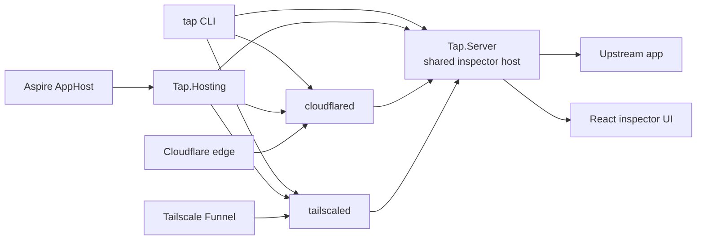
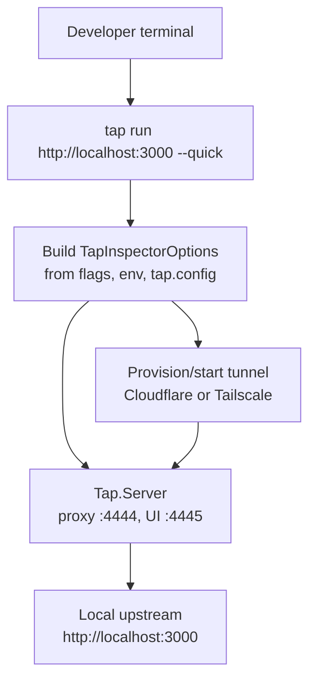
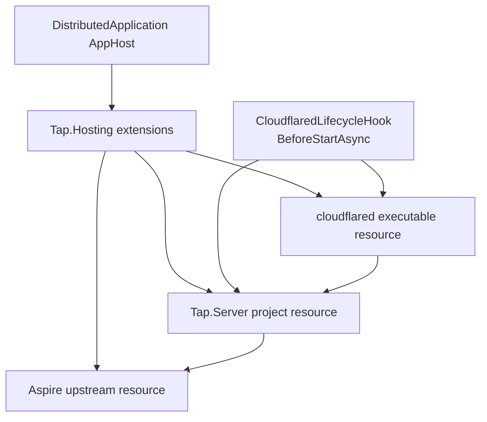
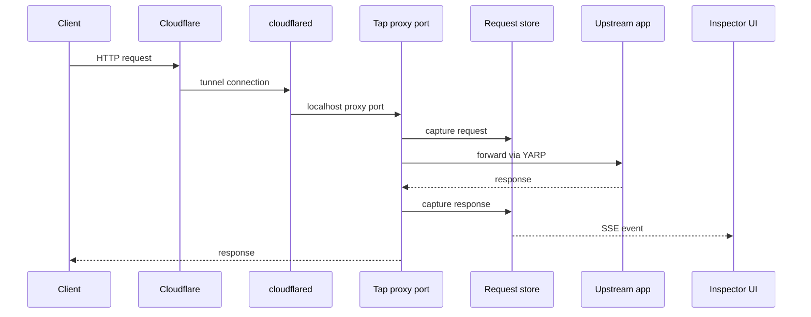
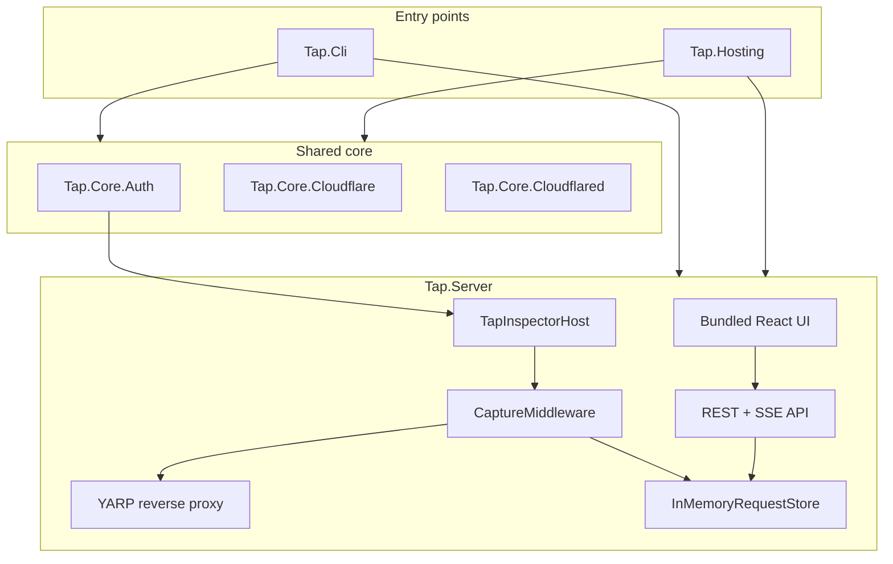
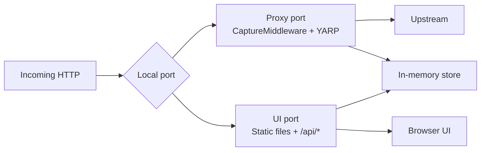

# Tap Architecture

> Scope: this document covers **Tap Tunnels**—the tunnel providers, the capture proxy, and its
> built-in Inspector UI. Tap Studio, the request and auth credential crafter, is a separate product with
> its own stack; see [studio.md](studio.md) and [workspace-format.md](workspace-format.md).

Tap Tunnels has two user-facing entry points and one shared runtime:

The CLI is the direct path for local, ad hoc work: point Tap at an upstream URL and optionally add a tunnel. Aspire is the modeled path: declare inspectors and tunnels beside your app resources and let the AppHost resolve ports, hostnames, and DNS before startup. Tap supports two tunnel providers — **Cloudflare** (named tunnels with optional API/DNS management) and **Tailscale Funnel** (one upstream per tailnet node, ports 443/8443/10000).

## High-Level Flows

### CLI

The CLI owns process orchestration. It can install `cloudflared`, provision Cloudflare tunnels, start `cloudflared`, configure Tailscale `serve` / `funnel`, run ephemeral `tailscaled` processes or the `tailscale/tailscale` Docker image, print the public URL, and then run the shared inspector server until Ctrl+C.

### Aspire

Aspire owns resource modeling. `Tap.Hosting` registers project and executable resources, the lifecycle hook resolves the final tunnel state, and `Tap.Server` receives its configuration through environment variables.

### Runtime Request Path

The proxy branch captures traffic before and after forwarding. The UI branch is local control-plane traffic: request history, replay, ingress, tunnel details, and the static React app.

`text/event-stream` responses and WebSocket upgrades are first-class. SSE events are parsed as the upstream writes them and WebSocket frames are pumped through a terminating proxy that records both directions; both flow types are pushed to the inspector over `/api/stream` (named `sse` / `ws` events) so the React UI's **SSE** and **WS** tabs append messages live while the connection is open.

## Components

### Tap.Cli

`Tap.Cli` is a command-line wrapper around the same server runtime used by Aspire.

| Command | Purpose |
|---|---|
| `tap run <upstream>` | Start a local inspector and forward traffic to an upstream URL. |
| `tap run <upstream> --quick` | Start a TryCloudflare quick tunnel. |
| `tap run <upstream> --token <token>` | Use a Cloudflare connector token. |
| `tap run <upstream> --api-managed <name>` | Look up or create an API-managed tunnel. |
| `tap run <upstream> --dynamic <zone>` | Mint a fresh hostname under a Cloudflare zone. |
| `tap run <upstream> --tailscale [--tailscale-port 8443]` | Route through Tailscale (system tailscaled, **tailnet-only via `tailscale serve`** — pair with `--tailscale-public` for `funnel`). |
| `tap run <upstream> --tailscale --tailscale-public` | Switch to public `tailscale funnel`; pair with auth flags. |
| `tap run <upstream> --tailscale --tailscale-authkey <key>` | Ephemeral mode: CLI spawns a userspace tailscaled, authenticates with the key, and tears it down on shutdown. |
| `tap run <upstream> --tailscale --docker` | Ephemeral mode via the `tailscale/tailscale` Docker image (same `--docker` flag also drives `cloudflare/cloudflared` when not in Tailscale mode). |
| `tap run --name <profile>` | Run a saved profile. Tailscale profiles can use system mode, ephemeral process mode from an auth key, or ephemeral Docker mode via `--docker`. |
| `tap install-cloudflared` | Install `cloudflared` with the host package manager. |

The CLI reads command flags first, then environment variables (`TAP_UPSTREAM`, `CLOUDFLARE_TUNNEL_TOKEN`, `CLOUDFLARE_API_TOKEN`, `CLOUDFLARE_ACCOUNT_ID`, `TAILSCALE_AUTHKEY`, `TAILSCALE_LOGIN_SERVER`), then optional `tap.config` defaults.

### Tap.Hosting

`Tap.Hosting` lives in the `Aspire.Hosting` namespace so consumer AppHosts can use Tap as normal Aspire extension methods.

| Extension | Purpose |
|---|---|
| `AddTap<TTapServer>()` | Register `Tap.Server` as an Aspire project with proxy and UI endpoints. |
| `AddTapContainer(...)` | Same Tap, hosted as a Docker container. |
| `WithTap(tap)` | Route a resource through a tap (and its tunnel, if attached). Dispatches by tunnel resource type to the right provider attach path. |
| `tap.WithTunnel(name, configure)` | Attach a Cloudflare tunnel as a child of the tap. |
| `tap.WithQuickTunnel()` | Attach a TryCloudflare quick tunnel wired to the tap's proxy port. |
| `tap.WithTailscaleServe(name?, configure?)` | Attach a Tailscale `serve` (tailnet-only — the safe default) as a child of the tap. |
| `tap.WithTailscaleFunnel(name?, configure?)` | Attach a Tailscale `funnel` (publicly exposed — opt-in, pair with auth) as a child of the tap. |
| `WithExistingTunnel(token)` | Run cloudflared against a tunnel created in the Cloudflare dashboard. |
| `WithApiManagedTunnel(...)` | Create or reuse a named tunnel using the Cloudflare API. |
| `WithDynamicHostname(...)` | Mint hostnames and DNS CNAMEs before startup. |
| `WithSystemDaemon()` / `WithEphemeralDaemon(authKey)` | Toggle Tailscale daemon mode: reuse the host's tailscaled, or spawn a userspace one per session. |
| `WithFunnelPort(port)` | Pick the Tailscale Funnel public port (443 default, 8443, 10000). |
| `AddCloudflaredTunnel()` / `AddTailscaleFunnel()` | Low-level escape hatches: register the tunnel resource directly without binding it to a tap. |
| `AddTapStudio<TStudio>()` | Register Tap Studio as an Aspire project, pinned to a workspace folder in the repo. Needs a `ProjectReference` to `Tap.Studio` and yarn on PATH. |
| `AddTapStudioContainer(...)` | Same Studio, hosted as a Docker container (`ghcr.io/philbir/tap-studio`): no project reference, nothing to build. The workspace becomes a bind mount at `/workspace`, state a named volume at `/state`. |

`WithApi(api)` injects the standard service-discovery variables and records the API for first-run scaffolding. It also takes `openApi:`, defaulting to `/openapi/v1.json` — the path ASP.NET Core serves out of the box — so on first run the Studio fetches that document and generates a request per operation instead of a placeholder. That fetch runs in a hosted service *after* the app is listening, never on the boot path, and falls back to the starter request if the API doesn't answer.

Both Studio shapes return the same `TapStudioHandle`, so `WithApi`, `WithWorkspaceFolder`, and `CallbackUrl` read identically either way — that is why the handle wraps `IResource` rather than a builder of one concrete resource type.

The provider-agnostic shape lives in `Tap.Hosting/Tunnels/`: `TapTunnelResource` (abstract base), `TapTunnelAnnotation` (sibling of `CloudflareTunnelAnnotation`), and `TapTunnelIngress`. `CloudflaredTunnelResource` and `TailscaleFunnelResource` both inherit `TapTunnelResource`, so `TapHandle.AttachedTunnel` is typed as the base and `WithTap<T>` runtime-dispatches via `is` checks.

The generic `TTapServer` is the project metadata type emitted by Aspire's AppHost source generator, usually `Projects.Tap_Server`. Because that type exists only in the consumer's AppHost project, the consumer project must reference `Tap.Server` directly.

### CloudflaredLifecycleHook

In Aspire, tunnel and DNS state has to exist before `cloudflared` starts. `CloudflaredLifecycleHook` runs in `BeforeStartAsync` and handles that setup.

| Responsibility | Why it happens before start |
|---|---|
| Verify or install `cloudflared` | Fail early when the tunnel binary is unavailable. |
| Look up or create API-managed tunnels | Local ingress config needs a tunnel id and credentials file. |
| Write credentials JSON | `cloudflared tunnel --config ... run <id>` consumes this file. |
| Resolve zones | Dynamic hostnames and DNS CNAMEs need the correct Cloudflare zone id. |
| Mint dynamic hostnames | Aspire annotations and inspector ingress entries need final public hostnames. |
| Ensure DNS CNAMEs | Public hostnames must point to `<tunnelId>.cfargotunnel.com`. |
| Back-fill annotations | Aspire URL chips and the inspector UI should show final tunnel details. |
| Watch quick tunnel logs | TryCloudflare URLs only appear after cloudflared emits them. |

For API-managed tunnels, existing tunnels are reused only when Tap can find a matching local credentials file. Cloudflare does not reveal an existing tunnel secret through the API, so Tap avoids destructive rotation and throws a clear setup error instead.

### TailscaleLifecycleHook

The Tailscale provider has its own lifecycle hook with disjoint responsibilities — both hooks scan their own resource types and don't touch each other's state.

| Responsibility | Why it happens before start |
|---|---|
| Verify the `tailscale` CLI is on PATH | Fail early when the CLI is missing. |
| In ephemeral mode, register a `TailscaledDaemonResource` (sibling resource) | The userspace daemon needs to show up in the Aspire dashboard with its own logs and shutdown ordering rather than as a leaked side-process. |
| Generate a per-resource bootstrapper script under `Path.GetTempPath()` | The script runs `tailscale up` (ephemeral), waits for the node to come Online, pre-warms the cert, configures the funnel, and stays alive. |
| Watch the bootstrapper's stdout for `TAP_TAILSCALE_HOSTNAME=...` | The MagicDNS name is only known after `tailscaled` reports Online; back-fill it into `TapTunnelAnnotation.Hostname` and the tap's "proxy" URL chip via `PublishUpdateAsync`. |

The bootstrapper is a bash script on macOS/Linux and a PowerShell script on Windows. Windows ephemeral process mode is intentionally not supported in v1 (the GUI service model gets in the way) — pair the auth key with Docker mode on Windows. All three Unix bootstrapper variants (system, ephemeral process, Docker) install an EXIT trap that removes the path-specific rule (`tailscale serve|funnel --https=$PORT --set-path=/ off`) so other manual rules on that port survive shutdown.

In Docker mode (`AddTailscaleFunnel(hostMode: TailscaleHostMode.Docker)` or `tap.WithTailscaleServe(..., hostMode: ...)`), the same companion `TailscaledDaemonResource` is registered but its command is `docker` and its args are `run --rm --name <id> -e TS_AUTHKEY=... -e TS_USERSPACE=true tailscale/tailscale:latest` (Linux gets `--add-host=host.docker.internal:host-gateway` automatically). The bootstrapper drives `tailscale` via `docker exec <container> tailscale ...` rather than bind-mounting the LocalAPI socket — bind-mounted unix sockets don't survive macOS Docker Desktop's VM boundary. It skips the `tailscale up` step (the container's entrypoint runs it from `TS_AUTHKEY`) and rewrites `localhost:<port>` → `host.docker.internal:<port>` so the funnel target is reachable from inside the container. Cleanup is the same: Aspire kills the `docker run` process, `--rm` removes the container.

### Tap.Server

`Tap.Server` builds one ASP.NET Core application bound to two ports.

`TapInspectorHost.Build()` registers the capture store, replay client, optional Cloudflare client, YARP routes, proxy branch, and UI branch. Both CLI and Aspire create `TapInspectorOptions` and pass them into this host.

## Capture Model

`CaptureMiddleware` sits before YARP in the proxy branch.

For each request it records:

| Field group | Examples |
|---|---|
| Identity | sequence, id, timestamp, method, host, path, remote IP. |
| Request | headers, content type, body size, captured text body when supported. |
| Response | status, headers, content type, body size, captured text or image body when supported. |
| Timing | duration in milliseconds. |
| Errors | proxy exception message when forwarding fails. |
| SSE events | per-event timestamp, name, id, retry, data — appended live as the upstream emits frames. |
| WebSocket frames | per-frame timestamp, direction (client/server), type (text/binary/close), payload (UTF-8 or base64), size, close code — appended live in both directions. |

Bodies are capped at 1 MB. Text-like content types are captured as UTF-8 strings; image responses are stored as base64 for UI rendering; unsupported or oversized bodies are marked truncated.

`text/event-stream` responses are detected on the first response write — Kestrel buffering is disabled so the wire flow stays real-time, every chunk is parsed against a small SSE state machine, and each dispatched event is appended to the record and broadcast as a named `sse` event on `/api/stream`.

WebSocket upgrade requests are detected before YARP. `WebSocketProxy` accepts the upgrade with `HttpContext.WebSockets.AcceptWebSocketAsync`, resolves the upstream from the ingress array, opens a matching `ClientWebSocket` (forwarding subprotocols and forwardable request headers), and pumps frames in both directions. Each completed text or binary message — plus `Close` frames — is recorded as a `WebSocketMessage { direction, type, text/base64, size, closeStatus }` on the record and broadcast as a named `ws` event on `/api/stream`. The capture cap (1 MB) applies per-message; oversized payloads are flagged truncated.

`InMemoryRequestStore` keeps the newest 200 records and fans out new records, named `sse` events, and named `ws` events to `/api/stream` subscribers over server-sent events.

## Configuration Shape

Both entry points converge on `TapInspectorOptions`.

| Option | CLI source | Aspire source |
|---|---|---|
| Proxy port | `--proxy-port`, default `4444` | `Inspector__ProxyPort`, default `5199` |
| UI port | `--ui-port`, default `4445` | `Inspector__UiPort`, default `5198` |
| Ingress | upstream argument / `TAP_UPSTREAM` / `tap.config` | resolved Aspire resource endpoint |
| Tunnel mode | `--quick`, `--token`, `--api-managed`, `--dynamic` | tunnel extension methods |
| Cloudflare credentials | CLI flags or env vars | .NET configuration / user-secrets |
| Tailscale auth key / login server | `--tailscale-authkey`, `TAILSCALE_AUTHKEY`, `--tailscale-login-server`, `TAILSCALE_LOGIN_SERVER`, profile | .NET configuration / user-secrets passed to `WithEphemeralDaemon(...)` |
| Auth | CLI auth flags | `Inspector:Auth` configuration |

The server itself does not care whether options came from a terminal command or an Aspire AppHost.

## Auth Boundary

The inspector UI port is local control-plane traffic and is not gated by Tap auth. It is instead confined to the local machine: it binds to `localhost`, answers only to a loopback `Host` header (or one listed in `Inspector:UiAllowedHosts`) so DNS rebinding cannot reach it, rejects cross-site browser requests via `Sec-Fetch-Site`, and redacts credentials from `/api/profiles`. The proxy port can enforce `Inspector:Auth` checks before requests reach the upstream:

| Mechanism | Source |
|---|---|
| Static header | Configured request header and value. |
| CIDR allowlist | `CF-Connecting-IP`, then `X-Forwarded-For`, then remote IP. |
| Country allowlist | `CF-IPCountry` header. |
| OIDC | Cookie plus OpenID Connect code flow. |

Enabled mechanisms are combined: a request must satisfy every configured check.

## Design Constraints

Tap intentionally keeps runtime state simple:

| Constraint | Current choice |
|---|---|
| Request history | In-memory, newest 200 records. |
| Body capture | 1 MB maximum per request or response body. |
| Persistence | None for captured traffic. |
| Transport | HTTP reverse proxy via YARP. |
| Live updates | Server-sent events. |
| Cloudflare setup | CLI provisioning or Aspire lifecycle provisioning. |

That makes Tap easy to run from a terminal and easy to model inside an Aspire AppHost.
